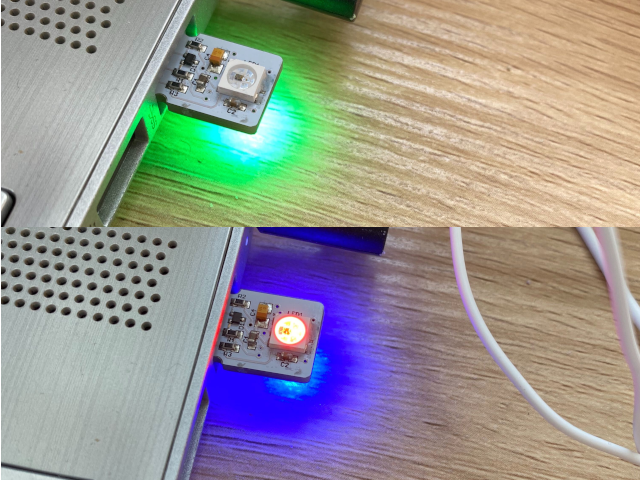
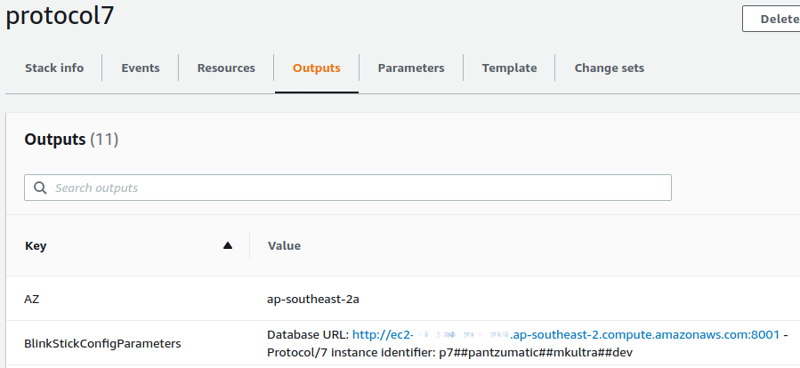

# p7devices

This repository contains code related to devices that can be controlled by [Protocol/7](https://github.com/TME520/protocol7).

## BlinkStick USB RGB LED light

Protocol/7 can control one or more BlinkStick USB RGB LED light. The models currently supported are [BlinkStick Nano](https://www.blinkstick.com/products/blinkstick-nano) and [BlinkStick Flex](https://www.blinkstick.com/products/blinkstick-flex).



### Installation

1. You need to have a [Protocol/7](https://github.com/TME520/protocol7) server running,
2. You then need to clone the [p7devices](https://github.com/TME520/p7devices) repository locally,
3. Configure your local instance of p7devices:

The configuration information is made available in the *Outputs* tab of the Cloudformation deployment for your Protocol/7 stack:



`$ vi startBStick.sh`
```
#!/bin/bash

echo 'Setting environment variables:'
echo -e '\t- BlinkStick instance identification'
export NAME='<NAME OF THE STACK RUNNING PROTOCOL/7>'
export NICKNAME='<A NICKNAME FOR THE PROTOCOL/7 INSTANCE>'

echo -e '\t- Credentials'

echo -e '\t- Parameters...'
export DYNAMODBURL='http://<DNS NAME OF THE EC2 INSTANCE RUNNING PROTOCOL/7>:8001'
export CB1DATAFOLDER='./bstick_data/'
export LOGSFOLDER='./log/'
export LOGFILENAME='bstick_default.log'
export CONFIGFILE='sample_config'
export P7INSTANCEID='<ID OF THE PROTOCOL/7 SERVER>'

echo -e '\t- Preferences...'
# 0 = OFF
# 1 = ON
export ENABLEBSTICK=1

echo 'Starting BlinkStick instance '$NAME' ($NICKNAME)'
python3 ./bstick.py

exit 0
```

4. Plug your Blinkstick Nano in a USB port.

Use `lsusb` in order to get idVendor and idProduct.

`$ vi /etc/udev/rules.d/99-blinkstick.rules`

`SUBSYSTEM=="usb", ATTR{idVendor}=="20a0", ATTR{idProduct}=="41e5", MODE="666"`

5. Restart udev: `$ /etc/init.d/udev restart`

### Usage

1. Check your BlinkStick Nano is plugged in,
2. Make sure the [Protocol/7](https://github.com/TME520/protocol7) server is running,
3. Go to `./p7devices/bstick_nano/`
4. Run `$ ./startBStick.sh`

### Colors and their meaning

The BlinkStick Nano has two RGB LEDs, one on each side. Their color can be programmed independantly.
In our case, the BlinkStick client queries the message queue every 2 seconds.

|Top LED color|Bottom LED color|Meaning|
|---|---|---|
|GREEN|GREEN|All clear|
|BLUE (blinking)|GREEN|Protocol/7 is waiting for next cycle to begin|
|off|BLUE|Protocol/7 is starting|
|GREEN|BLUE|Protocol/7 is refreshing its data (new cycle). All is good.|
|ORANGE/RED|BLUE|Protocol/7 is refreshing its data, previous test cycles revealed issues with the services being monitored.|
|ORANGE|ORANGE|An incident just started on one or more of the monitored services.|
|RED|RED|There is a confirmed incident on one or more of the monitored services.|
|WHITE|Any color|Protocol/7 has a network connectivity issue.|
|PINK|Any color|Protocol/7 could not call the monitored URL because of expired credentials.|

## Ex-Anki / Digital Dream Labs Cozmo robot

### Installation

#### Android Debug Bridge

```
$ cd $HOME/Downloads
$ wget https://dl.google.com/android/repository/platform-tools-latest-linux.zip
$ unzip ./platform-tools-latest-linux.zip
$ mkdir android-sdk-linux
$ mv ./platform-tools android-sdk-linux
$ cd android-sdk-linux/platform-tools
$ ls adb
$ mv /home/tme520/Downloads/android-sdk-linux/ /home/tme520/
$ vi ~/.bashrc
```
`export PATH=${PATH}:~/android-sdk-linux/platform-tools`
```
$ source ~/.bashrc
$ which adb
```